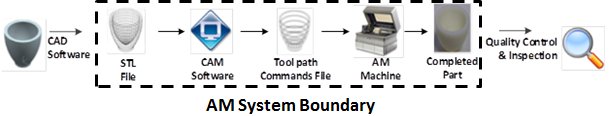

# Cyber-physical Manufacturing Security

### Project Overview
**Goal:**
To develop methods for detecting and preventing cyber attacks on additive manufacturing systems through education, process monitoring, and the design of security features.

**Description:**
One of the key advantages of additive manufacturing (AM) is its digital thread, which allows for rapid communication, iteration, and sharing of a design model and its corresponding physical representation. While this enables a more efficient design process, it also presents opportunities for cyber-attacks to impact the physical word. This project examine potential attack vectors along the Additive Manufacturing process chain. Specifically, the effects of cyber-physical attacks, and potential means for detecting them. As part of the project the potential for attacks has been demonstrated by placing voids in sample parts. Techniques for detecting and preventing this type of attack are explored.

 
 

**Related Publication**
[Cyber-Physical Vulnerabilities in Additive Manufacturing Systems](http://sffsymposium.engr.utexas.edu/sites/default/files/2014-075-Sturm.pdf)

Investigators
 - Logan Sturm
 - Jules White
 

 
